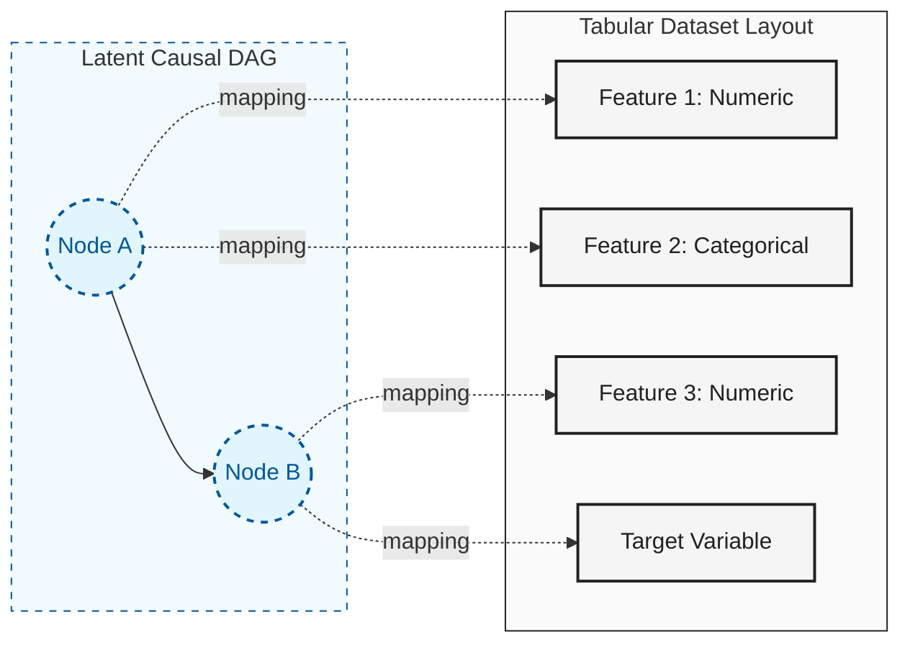

# dagzoo

High-throughput synthetic tabular data generation built around causal structure.
Use it to generate, benchmark, and stress-test tabular datasets with
deterministic seed behavior.

```mermaid
flowchart LR
    %% Class Definitions
    classDef setup fill:#e1f5fe,stroke:#01579b,stroke-width:2px,color:#01579b
    classDef core fill:#fff3e0,stroke:#e65100,stroke-width:2px,color:#e65100
    classDef out fill:#f3e5f5,stroke:#4a148c,stroke-width:2px,color:#4a148c

    Seed([Root Seed]) --> RNG[Deterministic Seeding]
    RNG --> Layout[Layout & DAG Sampling]
    Layout --> Mechanisms[Random Functional Mechanisms]
    Mechanisms --> Converters[Feature/Target Converters]
    Converters --> Bundle[[DatasetBundle: X, y, Metadata]]

    %% Assign Classes
    class Seed,RNG setup
    class Layout,Mechanisms,Converters core
    class Bundle out
```



### From Latent DAG to Tabular Data

Unlike many generators that treat each column as an independent noise source, `dagzoo` generates data from a **latent causal structure**. A single node in the causal graph can branch into multiple observable features, preserving complex dependency patterns.



## Why dagzoo

Researchers need synthetic tabular corpora whose structure, regime, and
robustness envelope they can control. The graph structure, functional
relationships, noise, shift, and missingness settings chosen at generation time
directly shape what downstream models train on.

`dagzoo` provides explicit control over graph structure, mechanism families,
noise distributions, distribution shift, missingness, and canonical fixed-layout
generation semantics. It is designed for researchers who need repeatable
synthetic tabular generation with clear control over the main axes of variation
in the resulting corpus.

`dagzoo` is for situations where you need synthetic tabular data that is:

- Causally structured: datasets are generated from a sampled latent DAG, not
  independent column noise.
- Reproducible: deterministic seed fan-out and effective-config trace artifacts
  make runs auditable.
- Stress-testable: shift, noise, and missingness controls let you probe model
  robustness under controlled distribution changes.
- Operationally scalable: canonical fixed-layout generation and benchmark
  guardrails support repeatable high-throughput workflows.

## Quick Start

Examples in this README assume a repo checkout (so `configs/*.yaml` is available):

```bash
./scripts/dev bootstrap
source .venv/bin/activate
./scripts/dev doctor all
```

Install the packaged CLI globally when you do not need repo presets/config files:

```bash
uv tool install dagzoo
```

Generate a default batch from the repo:

```bash
dagzoo generate --config configs/default.yaml --num-datasets 10 --out data/run1
```

Or stream canonical task samples directly into a PyTorch training loop:

```python
from dagzoo import build_dataloader

loader = build_dataloader(
    "configs/default.yaml",
    num_datasets=10,
    seed=7,
    device="cpu",
)
sample = next(iter(loader))
print(sample.keys())
```

Use `build_dataloader(...)` as the recommended PyTorch entrypoint for
task-sized samples with `X_train`, `y_train`, `X_test`, `y_test`,
`feature_types`, and `metadata`. Reach for `DagzooDataset` only when you need
the lower-level iterable dataset interface. The current v1 bridge supports
`num_workers=0`; see the usage guide for the full API contract.

Each generate run writes `effective_config.yaml` and `effective_config_trace.yaml`
in the resolved output directory.
`dagzoo generate` samples one internal fixed-layout plan per run, so all
datasets emitted in the same run share one sampled layout/execution plan.
Generate configs must not include `runtime.worker_count` or
`runtime.worker_index`.

Run a downstream handoff workflow from `generate`:

```bash
dagzoo generate --config configs/default.yaml --num-datasets 10 --handoff-root handoffs/run1 --device cpu --hardware-policy none
```

`dagzoo generate --handoff-root` writes one stable handoff root with:

- `handoff_manifest.json` as the downstream machine-readable entrypoint
- `generated/` for raw shard outputs plus effective-config artifacts

Run a smoke benchmark:

```bash
dagzoo benchmark --suite smoke --preset cpu --out-dir benchmarks/results/smoke_cpu
```

`--device` is a single-preset benchmark override. For multi-preset benchmark
runs, set the device in each preset/config instead of passing one shared CLI
override.

Inspect detected hardware tier:

```bash
dagzoo hardware
```

## Workflow Surfaces

`dagzoo` is the canonical packaged CLI. Use `./scripts/dev` as the fast
repo-local path for bootstrap, doctor, review-base, impact, ready, and verify
flows.

| Surface         | Use it for                                                                                 |
| --------------- | ------------------------------------------------------------------------------------------ |
| `dagzoo`        | Canonical packaged CLI for generation, benchmarking, corpus-audit, and hardware workflows. |
| `./scripts/dev` | Fast repo-local bootstrap, doctor, review, and verification flows.                         |

Use `--help` in this order:

1. `dagzoo --help`
1. `dagzoo <command> --help`

CLI layout:

```text
dagzoo
├── generate
├── filter
├── benchmark
├── diversity-audit
└── hardware
```

Local repo workflow before review:

```bash
./scripts/dev review-base
./scripts/dev ready
```

For focused local analysis outside the pre-review flow:

```bash
./scripts/dev impact
./scripts/dev verify quick
```

## Documentation

Primary docs site:

- [https://bensonlee5.github.io/dagzoo/docs/](https://bensonlee5.github.io/dagzoo/docs/)

Start here for end-user workflows and contracts:

- [How It Works](https://bensonlee5.github.io/dagzoo/docs/how-it-works/): System flow and terminology.
- [Transforms (Math Reference)](https://bensonlee5.github.io/dagzoo/docs/transforms/): Formal transform math, notation, and operator definitions.
- [Usage Guide](https://bensonlee5.github.io/dagzoo/docs/usage-guide/): Primary workflow hub.
- [Output Format](https://bensonlee5.github.io/dagzoo/docs/output-format/): Output schema and artifacts.
- [Feature Guides](https://bensonlee5.github.io/dagzoo/docs/features/): Diagnostics, missingness, many-class, shift, noise, and benchmark guardrails.

If you are integrating `dagzoo` downstream, treat these as the stable
references:

- Handoff workflow and CLI usage: [Usage Guide](https://bensonlee5.github.io/dagzoo/docs/usage-guide/)
- Generated artifacts and handoff manifest schema: [Output Format](https://bensonlee5.github.io/dagzoo/docs/output-format/)
