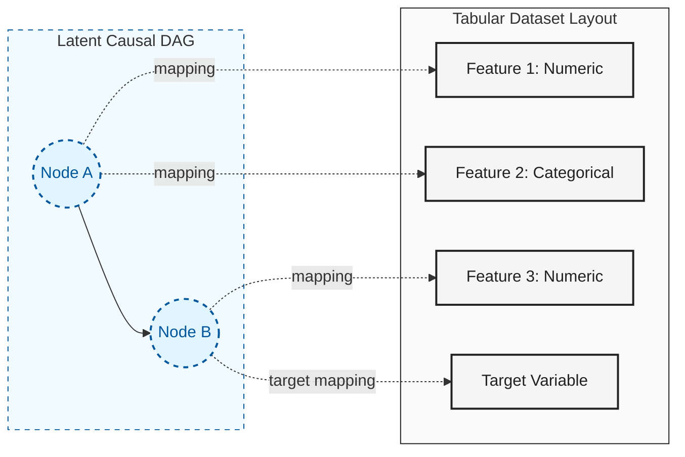

# dagzoo

`dagzoo` generates reproducible synthetic tabular datasets from latent causal
structure.

## Why dagzoo

- Start from a curated recipe catalog instead of reverse-engineering the full
  internal config surface.
- Generate datasets from sampled latent DAGs instead of treating each column as
  independent noise.
- Use the same recipe surface from the packaged CLI and the PyTorch bridge.
- Reproduce runs with `effective_config.yaml`,
  `effective_config_trace.yaml`, and stable dataset metadata.

## Start

Use the packaged CLI when you want the public workflow without a repo checkout.
These are the main `dagzoo` commands most users start with:

```bash
uv tool install dagzoo

# Inspect the curated recipe catalog and see the stable public names.
dagzoo recipe list

# Generate a general-purpose baseline run under data/default_baseline/.
dagzoo generate --config recipe:default-baseline --num-datasets 25 --out data/default_baseline
```

Use a repo checkout when you want to edit configs, run docs tooling, or work on
the codebase:

```bash
./scripts/dev bootstrap
source .venv/bin/activate
.venv/bin/nox -s quick
```

For in-process training loops, use the same recipe references through the
PyTorch bridge. `build_dataloader(...)` is the in-process equivalent of running
`dagzoo generate --config recipe:<name>` from the CLI:

```python
from dagzoo import build_dataloader

# Load the same baseline recipe directly into a training loop.
loader = build_dataloader(
    "recipe:default-baseline",
    num_datasets=10,
    seed=7,
    device="cpu",
)
sample = next(iter(loader))
print(sample["X_train"].shape)
```

Large heterogeneous runs can switch to `runtime.layout_mode: stratified` to let
the generator batch compatible `(n_rows, n_features)` strata without collapsing
datasets onto one shared layout. Public `runtime.layout_mode: fixed` is no
longer supported.

## How it works

At a high level, `dagzoo` resolves a recipe or YAML config, derives
deterministic seeds, samples a latent causal structure plus feature/target
assignments, executes that latent graph, emits the target from one selected
latent node, and only then applies optional missingness as an observation model
over emitted features.

```mermaid
flowchart LR
    classDef setup fill:#e1f5fe,stroke:#01579b,stroke-width:2px,color:#01579b
    classDef core fill:#fff3e0,stroke:#e65100,stroke-width:2px,color:#e65100
    classDef out fill:#f3e5f5,stroke:#4a148c,stroke-width:2px,color:#4a148c
    classDef post fill:#e8f5e9,stroke:#1b5e20,stroke-width:2px,color:#1b5e20

    Config[Recipe or YAML config] --> Seed[Deterministic seeding]
    Seed --> Layout[Sample layout plus target-node selection]
    Layout --> DAG[Sample latent DAG plus feature and target assignments]
    DAG --> Exec[Execute latent node pipelines plus converters]
    Exec --> XComplete[Assemble complete features X_complete]
    Exec --> TargetConvert[Convert selected latent target node into y]
    XComplete --> Split[Apply split checks and postprocess]
    TargetConvert --> Split
    Split --> Missingness[Optional missingness over emitted features]
    Missingness --> Bundle[[Emit DatasetBundle or shard artifacts]]
    Bundle -. optional later replay .-> Filter[dagzoo filter]

    class Config,Seed setup
    class Layout,DAG,Exec,XComplete,TargetConvert core
    class Split,Missingness,Filter post
    class Bundle out
```



Unlike generators that treat each column as independent noise, `dagzoo`
generates both features and target from a latent causal structure. One node in
the sampled graph can branch into multiple observable features, and one
selected latent node is chosen during layout and assignment sampling, then later
emits the target through its converter stack after latent execution. Optional
missingness can later censor the emitted feature table without changing how
`y` was derived.



In practice, that means target-node selection happens early, target values are
emitted later after latent execution, and optional missingness only affects the
observed feature values emitted afterward.

## Public Surface

If you're new, start with the named recipes. The public surface is small on
purpose:

- `dagzoo recipe list` shows the curated recipe catalog.
- `dagzoo generate --config recipe:<name>` generates datasets from one of those
  published recipes.
- `build_dataloader("recipe:<name>", ...)` gives you the same recipe surface
  inside Python.

`recipe:<name>` is the stable public config handle most users should reach for
first. `recipes/*.yaml` are the published YAML files behind those names, so you
can inspect exactly what a recipe contains. Repo-local `configs/*.yaml` are for
custom local authoring and may change more often than the named recipe surface.

For example, this command generates 25 datasets from the baseline recipe:

```bash
# recipe:default-baseline is the named public config.
# --out chooses the run directory on disk.
dagzoo generate --config recipe:default-baseline --num-datasets 25 --out data/default_baseline
```

### What Lands on Disk

After that generate command finishes, this is the kind of layout you should
expect under the run root:

```text
data/default_baseline/
  effective_config.yaml
  effective_config_trace.yaml
  shard_00000/
    train.parquet
    test.parquet
    dataset_catalog.ndjson
  internal/
    shard_00000/
      replay_catalog.ndjson
      lineage/
        adjacency.bitpack.bin
        adjacency.index.json
```

The `shard_*` directories hold the stable public dataset artifacts. The
`internal/` tree holds dagzoo-only replay and lineage sidecars used by tooling
such as `dagzoo filter`; it is not the stable public contract.
`effective_config.yaml` records the fully resolved config for the run, and
`effective_config_trace.yaml` records where overrides came from so the run is
reproducible. The full artifact contract lives in `docs/output-format.md`.
The exhaustive field catalog lives in `docs/export-contract-fields.md`.

## Docs

- Published docs site: [bensonlee5.github.io/dagzoo](https://bensonlee5.github.io/dagzoo/)
- [Start](docs/start.md)
- [Reference Packs](docs/reference-packs.md)
- [Advanced Controls](docs/usage-guide.md)
- [Artifacts & API](docs/output-format.md)
- [Export Contract Fields](docs/export-contract-fields.md)
- [How It Works](docs/how-it-works.md)
- [Feature Guides](https://bensonlee5.github.io/dagzoo/docs/features/)

## Community

- [Contributing](CONTRIBUTING.md)
- [Security](SECURITY.md)
