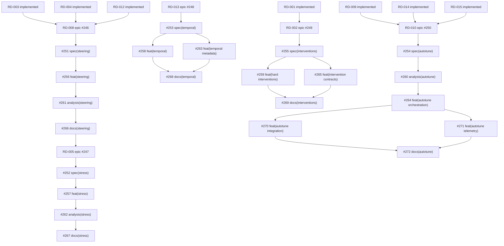

# Mission-Aligned Roadmap (2026Q1)

This is the canonical roadmap for `dagzoo`.

It maps the mission and strategic pillars in `README.md` to:

- current implemented capabilities
- known gaps
- prioritized roadmap items with explicit exit criteria
- canonical status/rank sequencing and tracker links

Related docs:

- Decision rubric and go/no-go gates: `docs/development/backlog_decision_rules.md`
- Evidence appendix: `reference/literature_evidence_2026.md`
- System behavior walkthrough: `docs/how-it-works.md`
- Output contract: `docs/output-format.md`

## Status Labels

- `implemented`: available in current code and exposed through config/CLI.
- `partial`: some building blocks exist, but mission-level claim is not fully met.
- `planned`: scoped and prioritized, not implemented.
- `research`: exploratory with higher uncertainty or risk.
- `retired`: historical item that no longer represents active roadmap work.

## Canonical Planning Metadata

`docs/development/roadmap.md` is the single source of truth for planning state. Every active item is tracked here with:

- status and milestone lane
- priority rank
- active GitHub issue chain plus any retained historical references
- dependencies and exit criteria

If any other document disagrees with this file, this file is authoritative.

Active roadmap execution is linked through the GitHub epics referenced in this
file. Historical Linear chains remain inline reference context only.

## PFN Utility Prioritization Lens

Roadmap ranking is currently optimized for downstream PFN utility:

- primary: curriculum-aware dataset levers that improve downstream model quality
  by making generated corpora thoughtfully harder while preserving
  reproducibility and acceptable throughput
- near-term downstream contract: carried curriculum/SCM slices need stable
  regime identity with comparable dataset-size and task-complexity bands, so
  steering and stress-profile work should preserve those identities rather than
  reopen retired stagewise complexity controls
- near-term evidence: recent harder-front evaluation currently favors noise
  drift, graph drift, and structured missingness over broader new generator
  subsystems as the next harder-front candidates
- implemented baseline: downstream handoff now ships through
  `dagzoo generate --handoff-root` plus `handoff_manifest.json` so downstream
  consumers can ingest generated corpora without a parallel request-only
  contract
- immediate follow-on: the next downstream ask is not a new handoff protocol;
  it is stable carried-slice identity and regime metadata on top of the
  shipped one-way handoff
- deferred: closed-loop feedback from downstream model predictions back into generation policy after the one-way handoff is stable

## Canonical Priority Queue

Lower rank means higher priority. Rank `0` is reserved for completed items retained for traceability.

| Rank | Roadmap ID | Item                                                                   | Status      | Milestone | Tracker Links                                                                                                    |
| ---- | ---------- | ---------------------------------------------------------------------- | ----------- | --------- | ---------------------------------------------------------------------------------------------------------------- |
| 0    | RD-001     | Ground-truth DAG artifact export                                       | implemented | Now       | `#44 -> #45 -> #46 -> #47 -> #48` (completed)                                                                    |
| 0    | RD-003     | Missingness generation (MCAR/MAR/MNAR)                                 | implemented | Now       | `#15 -> #17 -> #18` (completed)                                                                                  |
| 0    | RD-004     | Shift-aware SCM generation                                             | implemented | Now       | `#64 -> #72 -> #73 -> #74 -> #75` (completed)                                                                    |
| 0    | RD-006     | Curriculum complexity scaling (features + graph)                       | retired     | Now       | `#49 -> #50 -> #51 -> #90 -> #52 -> #53` (historical), `#142` (replacement)                                      |
| 0    | RD-007     | Many-class rollout envelope (`<=32` classes)                           | implemented | Now       | `BL-17 -> BL-18 -> BL-19 -> BL-20 -> BL-21` (completed), `BL-31` (closure)                                       |
| 0    | RD-012     | Noise family diversification for synthetic generation                  | implemented | Now       | `#24 -> #25 -> #26 -> #27` (completed)                                                                           |
| 0    | RD-014     | Stage-level benchmark observability and telemetry                      | implemented | Now       | `BL-82` (completed historical delivery under `BL-49`)                                                            |
| 0    | RD-015     | Keyed RNG semantic reproducibility                                     | implemented | Now       | `BL-90 -> BL-133 -> BL-134 -> BL-135 -> BL-136 -> BL-137`                                                        |
| 0    | RD-009     | Filtered dataset throughput and deferred-filter scaling                | implemented | Now       | `BL-49 -> BL-148 -> BL-149 -> BL-150` (completed), `BL-84 -> BL-85` (deferred follow-ons)                        |
| 0    | RD-016     | Generate-handoff manifest and one-way downstream handoff               | implemented | Now       | `BL-143 -> BL-144 -> BL-145 -> BL-146 -> BL-147` (completed)                                                     |
| 0    | RD-011     | Mechanism diversity expansion with measurable effective-diversity gain | implemented | Now       | `#28 -> #240` (completed), `#220` (later analytical follow-on), `BL-26 -> BL-151 -> BL-29 -> BL-30` (historical) |
| 0    | RD-008     | Meta-feature coverage steering                                         | implemented | Now       | `#246 -> #251 -> #256 -> #261 -> #266` (completed)                                                               |
| 1    | RD-005     | Robustness stress profiles (hard-task/adversarial regimes)             | research    | Now       | `#247 -> #252 -> #257 -> #262 -> #267`                                                                           |
| 2    | RD-013     | Time-series generation tracks for PFN pretraining                      | research    | Later     | `#248 -> #253 -> (#258 + #263) -> #268`                                                                          |
| 0    | RD-002     | Observational and hard-interventional generation modes                 | implemented | Now       | `#249 -> #255 -> (#259 + #265) -> #269` (completed)                                                             |
| 4    | RD-010     | Hardware-adaptive autotuning beyond coarse FLOPs tiers                 | planned     | Later     | `#250 -> #254 -> #260 -> #264 -> (#270 + #271) -> #272`                                                          |

## Dependency Graph

With RD-008 and RD-002 implemented, the active execution order is `RD-005`,
then the later lanes. Within `RD-013` and `RD-010`, the graph fans out where
the work can proceed in parallel after the schema/spec step.

## Current Capability Matrix

| README Mission/Pillar Claim                                         | Current State | Evidence in Repo                                                                                                                                                                                                                                                                                              | Gap                                                                                                                                              | Roadmap IDs    |
| ------------------------------------------------------------------- | ------------- | ------------------------------------------------------------------------------------------------------------------------------------------------------------------------------------------------------------------------------------------------------------------------------------------------------------- | ------------------------------------------------------------------------------------------------------------------------------------------------ | -------------- |
| Foundation model pretraining with diverse structural priors         | `partial`     | Heterogeneous-by-default public generation, shared grouped-runtime execution helpers, `dataset.rows`, deferred filtering, effective-diversity audits, diagnostics coverage aggregation, explicit noise/shift controls, stage-level throughput metrics, generate-handoff manifests, steering, and the shipped `piecewise` plus widened `gp` paths are implemented | Time-series generation tracks and broader named reference/stress packs remain active follow-on work                                              | RD-013, RD-005 |
| Causal discovery with ground-truth DAGs and interventional datasets | `implemented` | DAG lineage metadata, hard-interventional sampling semantics, summary-only intervention contracts, and handoff provenance are emitted with schema validation, discoverable presets, and user-facing workflow guardrails                                                                                      | Counterfactual paired-output generation remains deferred rather than part of the current public contract                                          | RD-002         |
| Robustness testing with hard tasks, shifts, adversarial regimes     | `partial`     | Deferred filtering, diagnostics proxies, missingness mechanisms, explicit noise-family controls, shift/drift controls, and steering are implemented with deterministic controls and benchmark guardrails                                                                                                      | Named hard-task and adversarial profile suites are not implemented yet                                                                           | RD-005         |
| Causal structural integrity (hierarchical dependencies)             | `implemented` | Graph-driven node pipeline, shared runtime execution, DAG lineage artifacts, hard-interventional generation, shipped mechanism-family diversity controls, and keyed RNG semantic reproducibility are implemented                                                                                             | Counterfactual paired-output generation remains deferred, but the current structural-generation contract is implemented                           | RD-002         |
| Tabular realism (mixed type + postprocess hooks)                    | `partial`     | Numeric/categorical converters, postprocess hooks, many-class rollout within the current `<=32` class envelope, configurable missingness, explicit noise families, shipped mechanism diversity controls, steering, and the current public generation runtime are implemented                                | Named robustness compositions over the shipped levers remain active work                                                                         | RD-005         |
| PFN task coverage (classification, regression, time-series)         | `partial`     | Classification and regression generation pipelines are fully supported with deterministic seeds, keyed replay metadata, and benchmark workflows                                                                                                                                                               | No time-series generation mode, temporal metadata contract, or temporal diagnostics/guardrails                                                   | RD-013         |
| Staged complexity scaling (features/nodes/samples)                  | `retired`     | Historical staged-complexity implementation (RD-006) has been retired in favor of explicit split sizing and the current heterogeneous/stratified generation model                                                                                                                                             | Not active                                                                                                                                       | RD-006         |
| Hardware-native performance (Torch + hardware-aware tuning)         | `partial`     | Torch CPU/CUDA/MPS path, hardware detection, coarse profile-based tuning, benchmark suite, and stage-level generation/write/filter metrics are implemented                                                                                                                                                    | Hardware-adaptive autotuning is not implemented; any further throughput work is deferred to later follow-ons after the completed RD-009 baseline | RD-010, RD-014 |
| Downstream synthetic-corpus handoff                                 | `implemented` | `dagzoo generate --handoff-root` emits `handoff_manifest.json`, writes generated handoff artifacts under `generated/`, and the docs describe a reproducible one-way downstream smoke workflow                                                                                                                 | Closed-loop downstream feedback remains intentionally deferred beyond the one-way handoff baseline                                               | RD-016         |

## Current Implementation Baseline

This roadmap does not duplicate the current codebase map or public contract.
Use the canonical docs instead:

- system/data-flow walkthrough: `docs/how-it-works.md`
- output and artifact contract: `docs/output-format.md`
- package/module structure: `docs/development/codebase-navigation.md`
- generated import/dependency map: `docs/development/module-dependency-map.md`
- packaged/runtime profiles: `configs/`
- source references: `reference/PAPERS.md` for TabICLv2 Appendix E (`E.2`-`E.14`),
  "A Closer Look at TabPFN v2", and
  "Accurate predictions on small data with a tabular foundation model"

### Reproducibility Strategy

1. Global run seed -> per-dataset seed -> per-component derived seeds.
1. `KeyedRng` provides the semantic RNG contract for generation/runtime code,
   while preserving deterministic child-seed derivation for replay and
   compatibility workflows.
1. Document expected backend variation (best effort, not strict bitwise
   determinism).

### Validation and Benchmarks

#### Correctness

- Unit invariants for ranges, shapes, DAG validity, converter class ranges, and
  matrix normalization.
- Unit/integration coverage for missingness mask invariants, deterministic
  behavior, and end-to-end metadata emission.
- Integration tests for end-to-end classification/regression paths.

#### Reproducibility

- Fixed seed should reproduce metadata exactly and numeric outputs within
  tolerance.

#### Performance

- Benchmark suites: `smoke`, `standard`, `full`.
- Artifacts: JSON + Markdown summaries under
  `benchmarks/results/<timestamp>/`.
- Soft regression gate: warn at configurable threshold, fail only on severe
  regression with `--fail-on-regression`.

## Roadmap Items

### RD-001: Ground-Truth DAG Artifact Export

- Status: `implemented`
- Milestone: `Now` (completed via epics/issues `#44`, `#45`, `#46`, `#47`, `#48`)
- Mission alignment: causal discovery
- Pillar alignment: causal structural integrity
- Goal: persist full adjacency matrix and node assignment lineage as stable dataset artifacts.
- Repo touchpoints: `src/dagzoo/core/dataset.py`, `src/dagzoo/core/layout.py`, `src/dagzoo/io/parquet_writer.py`, `src/dagzoo/types.py`
- Delivered scope:
  - Every generated dataset emits lineage metadata with adjacency + assignment lineage and deterministic seed behavior.
  - Persisted shard outputs rewrite dense adjacency into compact bit-packed artifacts with per-shard index files.
  - Validator enforces versioned dense/compact lineage schemas and compatibility rules.
  - Benchmark profiles report per-scenario benchmark summaries; lineage overhead is validated through normal IO and contract tests instead of runtime benchmarks.
- Completion evidence:
  - Docs and config presets include lineage workflow and benchmark examples.
  - Integration tests cover classification and regression generation + artifact persistence.
  - Existing config defaults remain backward-compatible.

### RD-002: Observational and Hard-Interventional Generation Modes

- Status: `implemented`
- Milestone: `Now` (completed via epic/issues `#249`, `#255`, `#259`, `#265`, and `#269`)
- Mission alignment: causal discovery
- Pillar alignment: causal structural integrity
- Goal: support observational and hard-interventional sampling tracks with explicit intervention specs and stable intervention identities on the canonical generation path.
- GitHub tracking: `#249 -> #255 -> (#259 + #265) -> #269` (completed)
- Repo touchpoints: `src/dagzoo/config/`, `src/dagzoo/core/dataset.py`, `src/dagzoo/core/fixed_layout/runtime.py`, `src/dagzoo/core/generation_runtime.py`, `src/dagzoo/io/parquet_writer.py`, `src/dagzoo/core/generate_handoff.py`
- Delivered scope:
  - `#255` completed the config schema and validation slice for observational and hard-interventional authoring.
  - Resolved/effective config now canonicalizes `intervention.targets` and derives `intervention.signature` for stable downstream identity.
  - `#259` implemented fixed hard-interventional truncated-factorization semantics on the canonical generation path.
  - `#265` added summary-only intervention metadata across in-memory bundles, public catalogs, replay sidecars, and handoff provenance.
  - `#269` added discoverable smoke presets, user-facing docs, observational/interventional artifact guardrails, and regression coverage for the documented workflows.
- Completion evidence:
  - Config supports opt-in hard interventions while observational generation remains the backward-compatible default.
  - Hard interventions execute with stable seeded semantics and stable intervention identity summaries downstream.
  - Public, replay, and handoff artifact contracts expose only `intervention.mode` and `intervention.signature`.
  - User-facing docs explicitly document supported selector kinds, observational defaults, and deferred counterfactual scope.

### RD-003: Missingness Generation (MCAR/MAR/MNAR)

- Status: `implemented`
- Milestone: `Now` (completed via epics/issues `#17` and `#18`)
- Mission alignment: foundation model pretraining, robustness testing
- Pillar alignment: tabular realism
- Goal: provide configurable missing-data mechanisms with deterministic seeded behavior and benchmark-time acceptance/runtime guardrails.
- Delivered scope:
  - `DatasetConfig` supports missingness controls (`missing_rate`, mechanism, MAR/MNAR scales). See [docs/how-it-works.md](../how-it-works.md) for MCAR/MAR/MNAR mechanism definitions.
  - `dagzoo generate` supports missingness CLI overrides.
  - Generation path injects deterministic missingness masks and emits per-bundle metadata.
  - Benchmark profiles emit `scenarios.missingness` including metadata coverage, realized-rate accuracy, and runtime degradation checks.
- Repo touchpoints: `src/dagzoo/config/`, `src/dagzoo/sampling/missingness.py`, `src/dagzoo/postprocess/postprocess.py`, `src/dagzoo/core/dataset.py`, `src/dagzoo/cli/`, `src/dagzoo/bench/suite.py`
- Completion evidence:
  - Config and CLI support opt-in mechanism selection and missing rate controls.
  - Tests validate expected missing-rate and dependency behavior.
  - Benchmark summaries include missingness guardrail metrics and status.

### RD-004: Shift-Aware SCM Generation

- Status: `implemented`
- Milestone: `Now` (completed via epics/issues `#64`, `#72`, `#73`, `#74`, and `#75`)
- Mission alignment: robustness testing, causal discovery
- Pillar alignment: causal structural integrity, tabular realism
- Goal: introduce controlled distribution-shift/drift modes in graph and mechanism sampling.
- GitHub tracking: epic `#64`; dependency chain `#72 -> #73 -> #74 -> #75`
- Repo touchpoints: `src/dagzoo/config/`, `src/dagzoo/core/dataset.py`, `src/dagzoo/core/shift.py`, `src/dagzoo/diagnostics/`, `src/dagzoo/bench/`, `configs/preset_shift_*.yaml`
- Delivered scope:
  - Shift controls are integrated into graph/mechanism/noise sampling with deterministic seeded behavior.
  - Per-bundle metadata and diagnostics expose resolved shift settings and observability signals.
  - Discoverable shift presets are available for generation and benchmark smoke workflows.
  - Benchmark profiles emit `scenarios.shift` with runtime, metadata-coverage, and directional checks against shift-disabled controls.
- Completion evidence:
  - Shift workflows are runnable directly from preset configs and documented in user-facing guides.
  - Integration tests cover shift metadata/diagnostics propagation and preset/CLI execution paths.
  - Benchmark summaries include scenario-level status and issues for shift, noise, missingness, filtering, and throughput.

### RD-005: Robustness Stress Profiles (Hard-Task/Adversarial Regimes)

- Status: `research`
- Milestone: `Now`
- Mission alignment: robustness testing
- Pillar alignment: tabular realism
- Goal: define reproducible named stress profiles and carried regime slices
  built from the current harder-data levers so contributors can run
  benchmark-guarded hard-task and adversarial-style regimes without inventing
  one-off configs, and downstream repos can hold the data regime fixed while
  comparing model scales.
- GitHub tracking: `#247 -> #252 -> #257 -> #262 -> #267`
- Repo touchpoints: `src/dagzoo/config/`, `src/dagzoo/core/config_resolution.py`, `src/dagzoo/functions/random_functions.py`, `src/dagzoo/postprocess/postprocess.py`, `src/dagzoo/bench/`, `src/dagzoo/sampling/missingness.py`, `src/dagzoo/core/shift.py`, `src/dagzoo/core/noise_runtime.py`
- Exit criteria:
  - Reproducible named stress presets are selectable via config/CLI and remain opt-in.
  - Stress profiles are composed from the lever families surfaced by RD-008, RD-003, RD-004, and RD-012 rather than bespoke parallel plumbing.
  - Benchmarks and diagnostics confirm regimes differ from baseline in intended directions.
  - Profiles expose stable regime identifiers and enough metadata for
    downstream matched-regime-budget comparisons, including comparable
    dataset-size/task-complexity envelopes when they are used as scaling
    slices.
  - Reproducibility tests pass for fixed seed runs.
- Delivery issues:
  - `#252` `spec(stress): define named robustness stress profiles and validation`
  - `#257` `feat(stress): integrate named stress profiles into generate and filter workflows`
  - `#262` `analysis(stress): add regime characterization and baseline-comparison diagnostics`
  - `#267` `docs(stress): add presets, tests, and benchmark guardrails for robustness profiles`
- Current repo baseline:
  - Curated recipe entries labeled `stress profile` remain adoption-layer
    examples rather than the carried-slice contract for downstream scaling.
  - `#252` introduces the first carried classification slice as
    `stress.profile=anti_memorization_piecewise_classification_slice_v1`,
    resolving onto the default classification envelope plus
    `steering.preset=anti_memorization_piecewise_v1`.

### RD-006: Staged Complexity Scaling (Features + Graph)

- Status: `retired`
- Milestone: `Now` (completed via epics/issues `#50`, `#51`, `#90`, `#52`, `#53`)
- Mission alignment: foundation model pretraining
- Pillar alignment: tabular realism
- Goal: historical; staged complexity controls have been removed in favor of
  explicit split sizing and the current heterogeneous/stratified generation
  model.
- GitHub tracking: epic `#49`; dependency chain `#50 -> #51 -> #90 -> #52 -> #53`
- Repo touchpoints (historical): `src/dagzoo/config/`,
  `src/dagzoo/core/dataset.py`

### RD-007: Many-Class Rollout Envelope (`<=32` Classes)

- Status: `implemented`
- Milestone: `Now` (completed via `BL-17`, `BL-18`, `BL-19`, `BL-20`, `BL-21`, with `BL-31` retained as closure note)
- Mission alignment: foundation model pretraining
- Pillar alignment: tabular realism, causal structural integrity
- Goal: land a stable many-class rollout envelope while keeping filter behavior and label handling interpretable.
- Linear tracking: historical epic `BL-17`; completion chain `BL-18 -> BL-19 -> BL-20 -> BL-21`; closure note `BL-31`
- Repo touchpoints: `src/dagzoo/config/`, `src/dagzoo/converters/categorical.py`, `src/dagzoo/filtering/structural_filter.py`, `docs/features/many-class.md`
- Delivered scope:
  - `dataset.n_classes_max <= 32` is enforced as the supported rollout envelope.
  - Converter and postprocess paths are hardened for the current many-class range.
  - Deferred filter diagnostics make accept/reject behavior interpretable within the current envelope.
  - Discoverable many-class generation and benchmark smoke workflows are documented.
- Completion evidence:
  - Config validation and user docs align on the supported envelope.
  - Integration and CLI tests cover the current many-class workflows.
  - Broader expansion beyond the current envelope is not an active roadmap item.

### RD-008: Meta-Feature Coverage Steering

- Status: `implemented`
- Milestone: `Now` (completed via epics/issues `#251`, `#256`, `#261`, and `#266`)
- Mission alignment: foundation model pretraining, robustness testing
- Pillar alignment: tabular realism, causal structural integrity
- Goal: build an opt-in curriculum-aware steering layer over existing missingness, shift/drift, and noise levers so generated corpora can progress through intentionally harder fronts without reviving retired stagewise feature/node/graph controls.
- GitHub tracking: `#246 -> #251 -> #256 -> #261 -> #266`
- Repo touchpoints: `src/dagzoo/diagnostics/coverage.py`, `src/dagzoo/diagnostics_targets.py`, `src/dagzoo/config/`, `src/dagzoo/sampling/missingness.py`, `src/dagzoo/core/shift.py`, `src/dagzoo/core/noise_runtime.py`, `src/dagzoo/cli/commands/diagnostics.py`, `docs/features/diagnostics.md`
- Delivered scope:
  - Steering is opt-in and reuses existing missingness, shift/drift, and noise surfaces instead of adding a parallel curriculum subsystem.
  - The shipped `anti_memorization_piecewise_v1` preset resolves deterministic stage movement over existing levers.
  - Diagnostics coverage artifacts record requested-versus-realized steering movement so fixed-seed runs stay auditable.
  - The implementation does not reintroduce the retired RD-006 stagewise feature/node/graph schema.
- Completion evidence:
  - Steering presets are documented and exposed through generation and benchmark workflows.
  - Diagnostics artifacts persist steering-aware coverage summaries.
  - Tests and changelog entries cover the shipped steering surface.
- Evidence context:
  - Current harder-front evaluation points toward a curriculum built from
    progressively harder missingness and drift regimes rather than a return to
    the retired RD-006 shell.
  - RD-008 steering outputs should stay usable as the upstream source for one
    carried harder-front slice, and follow-on stress-profile work should
    preserve that fixed-slice identity.
- Current repo baseline:
  - `diagnostics.meta_feature_targets` remains supported as reporting-only metadata for coverage summaries.
  - Steering is part of the current implementation baseline rather than future roadmap scope.
  - The next downstream ask is not a new curriculum subsystem; it is a stable
    naming/metadata contract over the shipped steering outputs so carried
    slices remain comparable in downstream scaling work.

### RD-009: Filtered Dataset Throughput and Deferred-Filter Scaling

- Status: `implemented`
- Milestone: `Now`
- Mission alignment: foundation model pretraining
- Pillar alignment: hardware-native performance
- Goal: improve accepted-corpus throughput on the canonical `generate -> filter` pipeline while preserving or improving effective diversity.
- Linear tracking: epic `BL-49`; completed chain `BL-148 -> BL-149 -> BL-150`; deferred follow-ons `BL-84 -> BL-85`; historical completed work `BL-82`, `BL-83`, `BL-86`
- Repo touchpoints: `src/dagzoo/filtering/deferred_filter.py`, `src/dagzoo/bench/stage_metrics.py`, `src/dagzoo/bench/suite.py`, `src/dagzoo/cli/`, `src/dagzoo/io/parquet_writer.py`
- Delivered scope:
  - `BL-148`: optimized deferred-filter replay throughput on canonical shard metadata without reviving worker orchestration.
  - `BL-149`: promoted filtered-corpus throughput and acceptance yield into first-class benchmark outputs and artifacts.
  - `BL-150`: added diversity-aware filter calibration guardrails so throughput tuning can be evaluated against diversity regression signals.
- Completion evidence:
  - Filter-enabled benchmark flows show filtered-corpus throughput alongside generation, write, and filter stage rates plus acceptance-yield signals.
  - Filter calibration and audit workflows can compare throughput or yield against diversity regression signals.
  - No new public worker-count or worker-index surface was added.
  - The active RD-009 workstream is complete; `BL-84` and `BL-85` remain deferred follow-ons rather than part of the completed critical path.

### RD-010: Hardware-Adaptive Autotuning Beyond Coarse FLOPs Tiers

- Status: `planned`
- Milestone: `Later`
- Mission alignment: foundation model pretraining
- Pillar alignment: hardware-native performance
- Goal: evolve hardware-aware scaling from static coarse profile tiers to bounded adaptive tuning based on observed throughput/memory behavior when throughput/cost becomes a practical bottleneck.
- GitHub tracking: `#250 -> #254 -> #260 -> #264 -> (#270 + #271) -> #272`
- Repo touchpoints: `src/dagzoo/hardware.py`, `src/dagzoo/config/`, `src/dagzoo/cli/`, `src/dagzoo/bench/suite.py`, `src/dagzoo/bench/report.py`
- Exit criteria:
  - Adaptive mode improves throughput versus profile baseline on at least one CUDA hardware class without violating memory guardrails.
  - Unknown CUDA devices can run adaptive tuning without relying only on static fallback tiers.
  - Fixed seed + fixed hardware signature reproduces selected tuning settings within declared deterministic behavior.
  - Opt-out mode preserves current profile-only behavior.
- Delivery issues:
  - `#254` `spec(autotune): add autotune mode config and CLI validation`
  - `#260` `analysis(autotune): define candidate parameter packs, scoring, and selection telemetry`
  - `#264` `feat(autotune): implement bounded trial orchestration and deterministic fallback`
  - `#270` `feat(autotune): integrate adaptive settings into generate flows with cache and fallback`
  - `#271` `feat(autotune): add benchmark integration and report telemetry`
  - `#272` `docs(autotune): add guardrails, tests, and presets for adaptive tuning`

### RD-011: Mechanism Diversity Expansion With Measurable Effective-Diversity Gain

- Status: `implemented`
- Milestone: `Now` (completed via `#28` and `#240`, with `#220` retained as a later analytical follow-on)
- Mission alignment: foundation model pretraining, robustness testing
- Pillar alignment: causal structural integrity, tabular realism
- Goal: complete mechanism diversity expansion by widening the current `gp` family behind the existing public surface, retaining `piecewise` as the shipped control, and landing the metadata, diagnostics, and audit surfaces needed to evaluate realized diversity behavior.
- GitHub tracking: completed epic `#28`; shipped closeout `#240`; later analytical follow-on `#220`; historical Linear chain `BL-26 -> BL-151 -> BL-29 -> BL-30`
- Repo touchpoints: `src/dagzoo/config/`, `src/dagzoo/functions/random_functions.py`, `src/dagzoo/core/node_pipeline.py`, `src/dagzoo/core/dataset.py`, `src/dagzoo/bench/suite.py`
- Delivered scope:
  - `mechanism.function_family_mix` is already live on the shared public generation runtime.
  - `piecewise` shipped as a public, mix-controlled mechanism family and serves as the current control path.
  - Internal `gp` execution now widens across `standard`, `periodic`, and `multiscale` variants without adding a new public config knob.
  - Bundle metadata, diagnostics coverage, and diversity-audit artifacts expose realized mechanism-family and mechanism-variant coverage.
  - GP-focused presets and docs exist so the widened path can be evaluated against baseline and the shipped `piecewise` control.
- Completion evidence:
  - [CHANGELOG.md](../../CHANGELOG.md) records the shipped widened `gp` path in `v0.9.7`.
  - The GitHub closeout issue `#240` is completed, and the remaining open work `#220` is analytical follow-on scope rather than unfinished roadmap delivery.

### RD-012: Noise Family Diversification for Synthetic Generation

- Status: `implemented`
- Milestone: `Now` (completed via epics/issues `#24`, `#25`, `#26`, `#27`)
- Mission alignment: foundation model pretraining, robustness testing
- Pillar alignment: tabular realism
- Goal: complete lean, low-complexity integration of explicit noise-family controls and mixtures to diversify residual/noise behavior without broad generator refactors.
- GitHub tracking: epic `#24`; dependency chain `#25 -> #26 -> #27` (completed)
- Repo touchpoints: `src/dagzoo/config/`, `src/dagzoo/sampling/`, `src/dagzoo/core/dataset.py`, `src/dagzoo/bench/suite.py`
- Delivered scope:
  - Config supports `gaussian`, `laplace`, `student_t`, and `mixture` families with safety validation.
  - Runtime sampling and generation metadata report requested/effective family settings.
  - Benchmark guardrails include metadata validation and runtime delta checks versus gaussian-noise controls.
  - Presets/docs/tests cover family-specific generation and benchmark workflows.
- Completion evidence:
  - All delivery issues in the chain are closed (`#25`, `#26`, `#27`).
  - End-user docs include noise workflow guidance and benchmark examples.

### RD-013: Time-Series Generation Tracks for PFN Pretraining

- Status: `research`
- Milestone: `Later`
- Mission alignment: foundation model pretraining, robustness testing
- Pillar alignment: tabular realism
- Goal: add an opt-in temporal generation track for sequence datasets so PFN pretraining workflows cover classification/regression/time-series under one reproducible generator framework.
- GitHub tracking: `#248 -> #253 -> (#258 + #263) -> #268`
- Repo touchpoints: `src/dagzoo/config/`, `src/dagzoo/core/dataset.py`, `src/dagzoo/core/node_pipeline.py`, `src/dagzoo/diagnostics/`, `src/dagzoo/bench/`, `docs/`
- Exit criteria:
  - Temporal mode is opt-in and backward-compatible (`off` by default).
  - Fixed seed + config reproducibility is preserved for temporal generation.
  - Sequence metadata/diagnostics contracts are emitted and test-covered.
  - Presets/docs/bench guardrails provide discoverable temporal workflows.
- Delivery issues:
  - `#253` `spec(temporal): define time-series config schema and validation`
  - `#258` `feat(temporal): implement lag-aware temporal generator path`
  - `#263` `feat(temporal): emit sequence metadata and diagnostics contracts`
  - `#268` `docs(temporal): add presets, tests, and benchmark guardrails for time-series workflows`

### RD-014: Stage-Level Benchmark Observability and Telemetry

- Status: `implemented`
- Milestone: `Now` (completed historically via `BL-82`)
- Mission alignment: foundation model pretraining, robustness testing
- Pillar alignment: hardware-native performance
- Goal: expose stage-level throughput telemetry for canonical benchmark runs so bottlenecks can be attributed before further runtime work is prioritized.
- Linear tracking: historical delivery `BL-82` under `BL-49`
- Repo touchpoints: `src/dagzoo/bench/stage_metrics.py`, `src/dagzoo/bench/suite.py`, `src/dagzoo/cli/`, `docs/features/benchmark-guardrails.md`
- Delivered scope:
  - Benchmark/report artifacts expose generation, write, and optional filter stage throughput instead of only total runtime.
  - Filter rejection and retry signals are surfaced for filter-enabled benchmark runs.
  - Stage metrics are stable enough to use in regression triage and backlog prioritization.
- Completion evidence:
  - Benchmark CLI summaries print stage-level throughput fields.
  - Benchmark JSON and Markdown artifacts persist stage-level metrics.
  - Subsequent throughput planning now relies on those stage metrics rather than inferred bottlenecks.

### RD-015: Keyed RNG Semantic Reproducibility

- Status: `implemented`
- Milestone: `Now` (completed via `BL-90`, `BL-133`, `BL-134`, `BL-135`, `BL-136`, and `BL-137`)
- Mission alignment: foundation model pretraining, robustness testing
- Pillar alignment: causal structural integrity, hardware-native performance
- Goal: replace order-coupled ambient RNG usage with keyed semantic namespaces so regrouping, retries, and scalar-vs-batched path changes preserve the intended reproducibility contract.
- Linear tracking: epic `BL-90`; dependency chain `BL-133 -> BL-134 -> BL-135 -> BL-136 -> BL-137`
- Repo touchpoints: `src/dagzoo/rng.py`, `src/dagzoo/core/`, `src/dagzoo/postprocess/`, `src/dagzoo/sampling/`, `src/dagzoo/bench/`, `docs/`
- Delivered scope:
  - Core generation/runtime randomness is keyed by semantic namespace rather than draw order or offset-only coupling.
  - `KeyedRng` is the semantic RNG surface used by runtime code.
  - Retrying one stage does not perturb sibling-stage randomness.
  - Scalar and batched typed-plan execution preserve semantic equivalence under the keyed contract.
  - Reproducibility docs describe `keyed_replay` and the intended non-goals of the contract.
- Completion evidence:
  - Repo code and tests exercise `KeyedRng` across generation, postprocess, missingness, and benchmark flows.
  - Generated bundle metadata includes keyed replay paths for canonical batch replay.
  - The Linear implementation chain is closed and moved to historical traceability.

### RD-016: Generate-Handoff Manifest and One-Way Downstream Handoff

- Status: `implemented`
- Milestone: `Now`
- Mission alignment: foundation model pretraining
- Pillar alignment: hardware-native performance, tabular realism
- Goal: let downstream repos consume generated corpora plus machine-readable handoff metadata directly from the canonical generate workflow, without a parallel request-only contract.
- Linear tracking: epic `BL-143`; dependency chain `BL-144 -> BL-145 -> BL-146 -> BL-147`
- Repo touchpoints: `src/dagzoo/cli/`, `src/dagzoo/core/`, `docs/`, downstream consumers
- Exit criteria:
  - `dagzoo generate --handoff-root` publishes a versioned handoff manifest without a separate request-file schema.
  - Handoff execution stays on the canonical generate path with effective-config traceability.
  - A machine-readable handoff manifest exposes generated-corpus paths,
    stage-throughput context, invocation metadata, and provenance summaries.
  - Docs include at least one reproducible one-way downstream smoke workflow.
  - Closed-loop feedback ingestion remains explicitly out of scope until the one-way handoff is stable.
- Completion evidence:
  - `dagzoo generate --handoff-root` rejects stale handoff roots before execution.
  - Handoff runs publish a versioned `handoff_manifest.json` at the handoff
    root with generated-corpus identity, artifact paths, and provenance
    summaries.
  - Public docs cover the handoff artifact layout, manifest contract, and
    one-way downstream smoke workflow.
  - The Linear implementation chain `BL-143 -> BL-144 -> BL-145 -> BL-146 -> BL-147` is closed.
  - The next downstream follow-on is carried regime identity on top of this
    manifest contract, not a second handoff protocol.

## Milestone Board

### Implemented

- RD-001 ground-truth DAG artifact export, completed via `#44`, `#45`, `#46`, `#47`, and `#48`
- RD-003 missingness generation (MCAR/MAR/MNAR), completed via `#17` and `#18`
- RD-004 shift-aware SCM generation, completed via `#64`, `#72`, `#73`, `#74`, and `#75`
- RD-011 mechanism diversity expansion with measurable effective-diversity gain, completed via `#28` and `#240`, with `#220` retained as a later analytical follow-on
- RD-007 many-class rollout envelope, completed via `BL-17`, `BL-18`, `BL-19`, `BL-20`, and `BL-21`
- RD-006 staged complexity scaling (retired), completed via `#49`, `#50`, `#51`, `#90`, `#52`, and `#53`
- RD-012 noise family diversification, completed via `#24`, `#25`, `#26`, and `#27`
- RD-014 stage-level benchmark observability and telemetry, completed via `BL-82`
- RD-015 keyed RNG semantic reproducibility, completed via `BL-90`, `BL-133`, `BL-134`, `BL-135`, `BL-136`, and `BL-137`
- RD-016 generate-handoff manifest and one-way downstream handoff, completed via `BL-143`, `BL-144`, `BL-145`, `BL-146`, and `BL-147`

### Now

- RD-008 meta-feature coverage steering
- RD-005 robustness stress profiles

### Later

- RD-013 time-series generation tracks
- RD-010 hardware-adaptive autotuning

## Dependencies and Sequencing

- RD-014 is implemented and provided the stage-level evidence that justified centering RD-009 on deferred-filter throughput rather than speculative public parallelism.
- RD-015 is implemented and provides the semantic RNG contract that active throughput or handoff work must preserve.
- RD-009 is implemented and now serves as the baseline canonical `generate -> filter` pipeline for later handoff and runtime work.
- RD-016 is implemented on top of the canonical `generate -> filter` pipeline from RD-009 and does not introduce a parallel configuration surface that the repo has already removed.
- RD-016 is sufficient for the current one-way downstream handoff; the next
  downstream gap is stable carried-slice identity and regime metadata, not a
  new handoff protocol.
- RD-011 is implemented and provides the shipped mechanism-diversity baseline; `#220` remains a later analytical follow-on rather than unfinished roadmap delivery.
- RD-008 is the top active data-lever item because current harder-front
  evidence favors noise drift, graph drift, and structured missingness as the
  strongest near-term harder fronts.
- RD-008 should compose existing RD-003, RD-004, and RD-012 surfaces plus `diagnostics.meta_feature_targets` rather than reviving the retired RD-006 stagewise feature/node/graph shell.
- RD-008 should now also be read as the upstream contract for one carried
  harder-front slice in downstream classification scaling rather than as purely
  exploratory steering.
- RD-012 is implemented and provides explicit noise-family controls that RD-005 can consume later for stress-profile composition.
- RD-005 packages the lever families surfaced by RD-008 into reproducible named
  stress regimes and carried scaling slices with stable identifiers and
  comparable regime metadata; it depends primarily on RD-003, RD-004, RD-008,
  and RD-012 plus the existing filter and diagnostics observability.
- The first RD-005 carried-slice spec is
  `stress.profile=anti_memorization_piecewise_classification_slice_v1`; the
  older curated recipe `stress profile` labels remain examples rather than the
  fixed-slice retrieval contract.
- RD-013 fans out after `#253` into the temporal runtime lane `#258` and the metadata-contract lane `#263`, which rejoin at docs and guardrails `#268`.
- RD-013 remains later because the near-term downstream contract is one-way tabular corpus handoff, not temporal generation.
- RD-002 is implemented on top of the completed RD-001 lineage artifact surface and now provides the shipped observational plus hard-interventional workflow contract.
- Future counterfactual work should introduce a separate paired-output contract rather than reopen the shipped hard-intervention metadata surface implicitly.
- RD-010 moves linearly through spec, scoring, and orchestration (`#254 -> #260 -> #264`) before splitting into generate-path integration `#270` and telemetry/reporting `#271`, which rejoin at docs and guardrails `#272`.
- RD-010 remains opt-in and benchmark-guarded, but is sequenced later because downstream handoff, curriculum-aware harder-front steering, and reproducible stress-profile composition are more urgent than adaptive tuning.

## Guardrails

- New public config surfaces remain opt-in by default; internal widening behind an existing public family label must be explicitly documented when it changes emitted behavior.
- Existing config files remain valid unless explicitly versioned.
- Reproducibility expectations are mandatory for every roadmap item.
- Benchmark warn/fail thresholds remain the performance gate.
