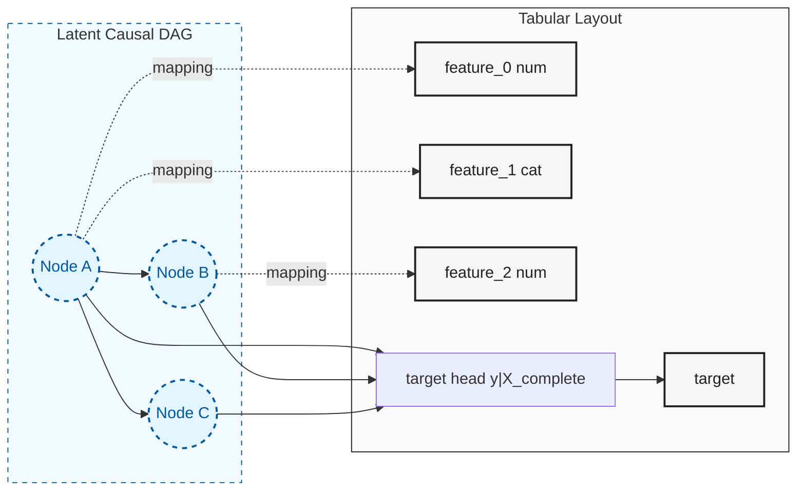
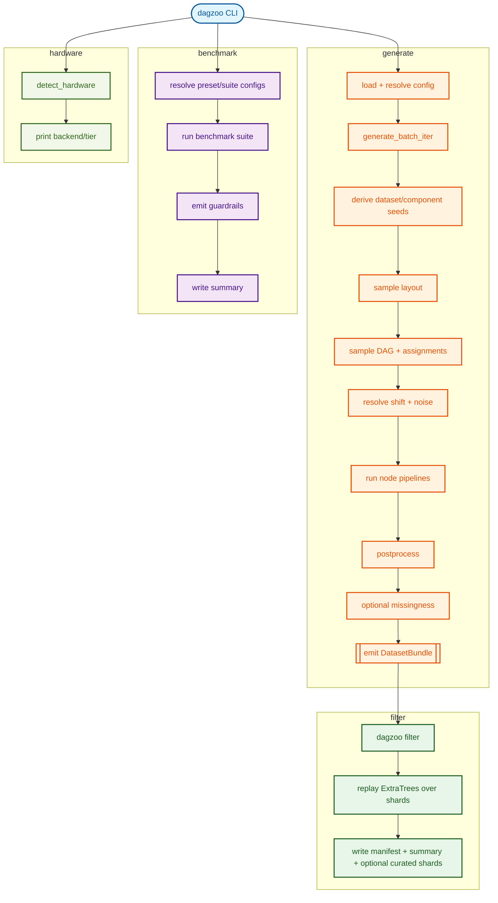
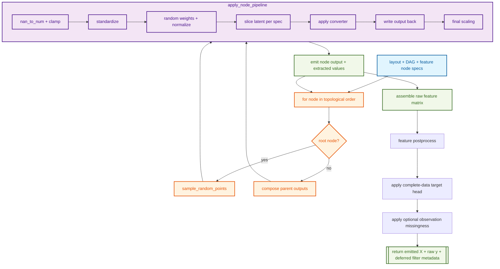

# How It Works {#how-dagzoo-works}

This guide explains `dagzoo` end-to-end with enough detail to reason
about behavior without needing to jump between many documents.

## Who this is for

- End users running `dagzoo generate` and `dagzoo benchmark`
- Users who want a deeper mental model of runtime behavior and outputs

## Mental model in 90 seconds

`dagzoo` synthesizes tabular datasets by sampling causal structure,
executing randomized mechanisms over that structure, and enforcing
quality and realism controls.

1. Resolve config and hardware context for the command.
1. Derive deterministic seeds for run, dataset, and component scopes.
1. Sample a dataset layout (feature types, assignments, graph size
   bounds).
1. Sample a feature-only latent DAG and feature-to-node assignments.
1. Execute node pipelines in topological order to produce latent
   feature outputs.
1. Convert latent feature outputs into complete `X_complete`.
1. Generate `y` from an independently sampled
   `p(y | X_complete)` conditional head.
1. Apply split checks and target postprocess, then optionally apply
   missingness as a joint observation process before emission.
1. Emit `DatasetBundle` outputs; optionally persist shards and
   diagnostics.
1. Persist shard outputs and effective-config artifacts; when needed,
   replay deferred acceptance with `dagzoo filter` as a separate stage.

## Core Concepts

### 1. Causal DAG vs tabular layout {#1-causal-dag-vs-tabular-layout}

The generation graph is a latent DAG, while emitted columns are a
tabular projection of that latent graph.

- Latent nodes represent abstract causal variables.
- Feature columns are assigned to latent nodes by sampled layout state.
- The target is generated after feature postprocess by a separate
  latent-complete-data conditional head.
- Multiple columns can map to one node, and one node can influence many
  columns.
- This decoupling allows rich causal interactions while preserving a
  clean acyclic execution graph.
- This is also important for prior diversity: a single latent DAG can
  produce many different observed tabular layouts (different feature-to-node
  assignments, different converter choices), so effective diversity grows
  faster than the number of unique DAG topologies sampled.



### 2. Reproducibility tree {#2-reproducibility-tree}

Reproducibility is driven by `KeyedRng`, which maps one base seed onto
named semantic subtrees.

- One run seed fans out into deterministic run, dataset, layout, split,
  missingness, noise, and benchmark subtrees.
- Public metadata exposes stable replay identifiers such as `seed`,
  `dataset_index`, `run_num_datasets`, and `dataset_seed`.
- Some canonical outputs also include detailed replay metadata such as
  `metadata.keyed_replay` when exact internal replay is needed.
- Changing one component path should not perturb unrelated component
  randomness.

Illustrative derivation chain:

```text
KeyedRng(run_seed)
  -> keyed("rows")
  -> keyed("plan_candidate", attempt, "layout")
  -> keyed("plan_candidate", attempt, "execution_plan")
  -> keyed("dataset", i, "noise_runtime")
  -> keyed("dataset", i, "attempt", attempt, "split")
  -> keyed("dataset", i, "attempt", attempt, "postprocess")
  -> keyed("dataset", i, "attempt", attempt, "missingness")
```

### 3. Split validity retries and reserved deferred-filter metadata {#3-split-validity-retries-and-deferred-filter-stage}

Generation retries cover split-validity and generation exceptions only.

- Retries are bounded by `filter.max_attempts` (retry budget reused from
  config).
- Emitted metadata records `attempt_used` and generation-attempt
  counters.
- Generated outputs mark `metadata.filter.mode=deferred` and
  `metadata.filter.status=not_run`.

Data-quality acceptance is a separate deferred stage:

- Generated outputs still carry deferred-filter metadata for traceability.
- `dagzoo filter` replays the small-shot ease ExtraTrees probe over emitted
  shards and writes accepted/rejected outcomes after generation.
- Request-driven handoff currently publishes generated shards only.

### 4. Effective config and traceability {#4-effective-config-and-traceability}

Generation and benchmark commands resolve effective config through
staged overrides, then validate constraints.

Generate path (high-level):

1. Base config YAML
1. Device override normalization
1. Hardware policy application
1. Missingness/diagnostics CLI overrides
1. Final generation constraint validation

Every run writes:

- `effective_config.yaml`
- `effective_config_trace.yaml`

The trace is field-level provenance (`path`, `source`, `old_value`,
`new_value`) for resolved settings.

### 5. Hardware-aware execution semantics {#5-hardware-aware-execution-semantics}

`dagzoo` tracks three related but distinct runtime notions:

- `requested_device`: normalized user intent (`auto`, `cpu`, `cuda`,
  `mps`)
- `resolved_device`: backend selected from request/environment
- `device`: backend used for dataset execution in that attempt

Notable runtime behavior:

- `auto` resolves to available accelerator first, else CPU.
- Backend runtime errors surface directly; generation does not rewrite the
  resolved device after execution starts.
- Split/postprocess control RNG runs on CPU to avoid tiny-op accelerator
  overhead.

## Mathematical Foundations

The generation pipeline is a multi-axis sampling process. Each formal section
in [transforms.md](transforms.md) corresponds to an independent axis of prior
diversity:

```
graph structure  ──┐
shift parameters ──┤
mechanism families ┤── together determine the region of meta-feature
node pipeline    ──┤   space the corpus covers (= effective diversity)
converters       ──┤
noise families   ──┘
```

Broadening one axis (e.g., adding noise families) increases diversity along
that dimension without affecting the others — the axes are designed to be
independently controllable. The formal specification matters because the
parameterization determines what prior regions are *reachable*: if a
transform's math restricts certain behaviors, no config change can produce
datasets in those regions.

- Canonical equations + implementation map:
  [transforms.md](transforms.md)
- Shared notation and symbol definitions:
  [transforms.md#notation-and-symbols](transforms.md#notation-and-symbols)

Quick index to the formal sections:

1. **DAG sampling**: strict upper-triangular Bernoulli sampling with
   Cauchy latent logits and shift-adjusted edge bias.
1. **Mechanism-family sampling**: family-mix weights plus mechanism
   logit tilt produce runtime family probabilities.
1. **Node pipeline**: root/parent composition, latent sanitization and
   weighting, converter slicing, and final scaling.
1. **Converters and noise**: numeric/categorical converter equations
   and dataset-level noise runtime selection (including mixture-mode
   behavior).

## End-to-end flow

This diagram shows command-level orchestration and where generation,
benchmarking, and hardware inspection diverge.



## Generation pipeline walkthrough

This section maps the runtime to the main execution phases and data flow.

### 1) Entry points and orchestration boundaries {#1-entry-points-and-orchestration-boundaries}

- `dagzoo generate` and `build_dataloader(...)` use the same canonical
  generation flow.
- Generation resolves config and hardware context, derives deterministic seeds,
  samples layout and structure, executes the latent graph, then finalizes
  outputs and metadata.
- `dagzoo filter` is a later acceptance/replay stage over emitted shards.
- `dagzoo benchmark` runs preset or custom suites over the same public
  generation surface.

### 2) Layout and structure sampling {#2-layout-and-structure-sampling}

- `_sample_layout` samples feature counts/types, class bounds, and
  feature-to-node assignments.
- `sample_dag` samples strict upper-triangular adjacency.
- Adjacency convention is `adjacency[src, dst]`; parents of node `j` are
  read from column `adjacency[:, j]`.

### 3) Node execution and tensor assembly {#3-node-execution-and-tensor-assembly}

- Nodes execute in index/topological order.
- Root nodes sample latent points directly.
- Child nodes consume parent outputs using multi-parent composition:
  - 50% path: concatenate parents and apply one mechanism
  - 50% path: apply per-parent mechanisms, then aggregate via
    `sum | product | max | logsumexp`
- Converter specs slice latent columns and emit feature values.
- Unassigned feature slots are filled with sampled noise.
- A separate latent-complete-data target head then generates raw targets from
  the postprocessed complete feature matrix.

### 4) Quality, shift/noise controls, and postprocessing {#4-quality-shiftnoise-controls-and-postprocessing}

- Shift runtime params modulate graph/mechanism/noise behavior when
  enabled.
- Noise runtime resolution picks one family per dataset in mixture mode,
  then propagates through node-level samplers.
- Split, target postprocess, and optional missingness run in-generation.
- Classification split validity is enforced before bundle emission.

Current public prior behavior:

- The shipped generator samples complete features first, then samples the
  target from that complete feature table.
- Optional missingness is applied afterward as an observation process over
  the emitted feature table.

Canonical postprocess behavior:

- Public generation preserves emitted schema across a canonical run.
- Classification runs now emit bundles as they are finalized; a later
  dataset can still exhaust the retry budget after earlier bundles have
  already been emitted.

### 5) Metadata and output emission {#5-metadata-and-output-emission}

Each bundle includes runtime metadata for lineage, deferred-filter
status, shift, noise distribution, and resolved config snapshot.

- `lineage` aligns emitted feature columns with DAG node assignments and
  records the latent-complete-data target mode.
- `requested_device`, `resolved_device`, and the reserved
  `device_fallback_reason` field are emitted for runtime observability.
- Canonical generation outputs add `layout_mode`, `layout_plan_seed`,
  `layout_signature`, `dataset_seed`, and `keyed_replay`.

## DAG/node data flow

This diagram focuses on node-level execution mechanics inside the
canonical generation runtime.



## Diagnostics, fixed layout, and benchmark guardrails

These are related but distinct runtime surfaces.

- Canonical fixed-layout generation controls structural consistency
  across emitted datasets.
- Diagnostics aggregates observability metrics across emitted bundles.
- Benchmark guardrails evaluate runtime/metadata regressions in suite
  runs.

## Glossary quick reference

- **layout**: sampled feature/task scaffold for one dataset.
- **DAG adjacency**: upper-triangular parent-child matrix, `src -> dst`.
- **node pipeline**: per-node transform and converter execution path.
- **converter spec**: instruction for extracting observable feature slices.
- **target head**: separately sampled conditional generator that maps the
  realized complete feature table to raw targets.
- **deferred filter**: ExtraTrees-based post-generation gate that rejects
  trivial small-shot tasks, pure garbage tasks, and optional structural
  no-path cases.
- **small-shot skill**: normalized held-out skill of the filter probe relative
  to a constant baseline.
- **shift runtime params**: resolved graph/mechanism/noise drift
  controls.
- **noise runtime selection**: per-dataset resolved noise family/params.
- **fixed-layout plan**: internal sampled layout/execution payload reused
  within one canonical run.
- **layout signature**: deterministic hash fingerprint of a sampled
  layout.
- **DatasetBundle**: in-memory output container with tensors + metadata.
- **effective config trace**: field-level override provenance artifact.

## Where to go next

- Canonical transform equations and symbol definitions:
  `docs/transforms.md`
- Output schema and metadata contract: `docs/output-format.md`
- CLI workflow examples: `docs/usage-guide.md`
- Recipe catalog and citations: `docs/reference-packs.md`
